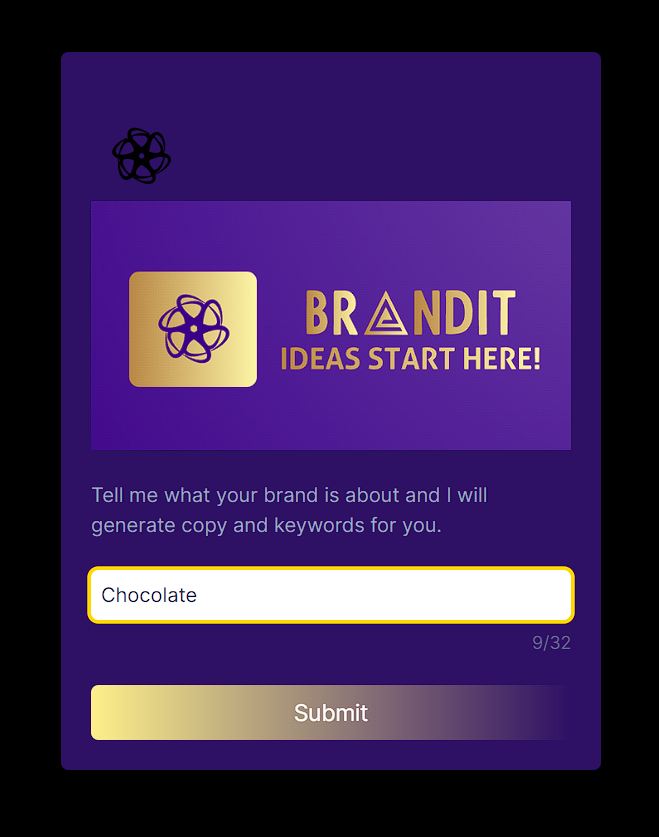
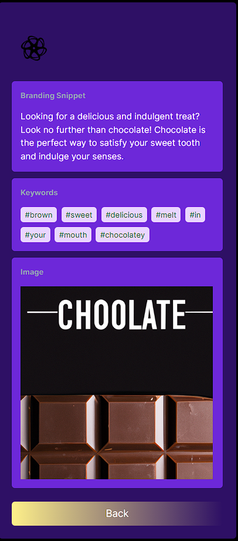

# BrandIt - Your AI-Driven Branding Companion

## 🚀 Overview
BrandIt is an AI-based web application that revolutionizes branding. By combining OpenAI's DALLE 2 and a suite of modern tech tools, it generates unique brand pitches, suggests keywords for improved online visibility, and creates striking advertising imagery. 
## **Try it here:**  
[BrandIt](https://brand-it-app.vercel.app/)  


**Preview**:    
  
    
Whether you're a budding startup or an established brand aiming to connect with a broader audience, BrandIt is your go-to branding solution. 

## 💡 Key Features
1. **AI-Generated Pitches** - Get captivating and unique brand pitches tailored for your product or service.
2. **Keyword Suggestions** - Optimize your online presence with AI-recommended keywords for your posts.
3. **Dynamic Advertising Images** - Convey your brand's essence through visually striking advertising images generated by DALLE 2.

## 🏗️ Built With
- Backend: FastAPI, AWS
- Data Handling: API Gateway
- Frontend: REACT, Typescript
- Hosting: Vercel

## 📦 Installation & Setup
0. Pre-requisition:
   - AWS  
   - AWS-CLI  
   - AWS-CDK
   - Node.JS
   - React with TypeScript
   - Yarn
   - Vercel
   Packages:  
   - FASTAPI
   - OpenAI
   - Mangum
   You will need to check out their documentation for the most updated usages  
2. Clone the repository to your git repo and run it locally:
    ```
    git clone https://github.com/YourUsername/BrandIt.git
    ```
3. Set up the Env Var for OPENAI_API_KEY: `$env:OPENAI_API_KEY = "Your key goes here" for local testing, but remember to add it in the dotenv for aws deploying
4. Setup FastAPI to create handler for AWS Lambda
5. Deploy the Backend to the AWS with the Lambda, API Gateway. You will also need to build up the base layer for the app with the docker file.
6. `yarn dev` to see the front end running. Please link up your git to Vercel to host it and start viewing on live.
## 📝 How to Use
1. Open the BrandIt web application.
2. Enter the details of your product or service.
3. Click on the 'Generate' button.
4. Get your AI-generated pitch, keywords, and advertising image.
5. You can save the output or generate a new one by clicking 'Generate' again.

## 🌐 Deployment
The BrandIt web application is hosted using Vercel. 

## 🙌 Contributing
Contributions are always welcome! See `CONTRIBUTING.md` for ways to get started.

## 📚 License
Distributed under the MIT License. See `LICENSE.md` for more information.

## 🤝 Contact
For any queries or suggestions, please reach out to us - `YourEmail@example.com`

